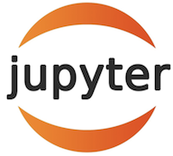
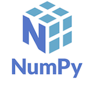

# Project-Debt-Free
Project Debt Free is a debt solution application that provides our customers with a platform to keep all of
their credit card balances in check. We assist them in determining their debt and aiding them with debt management.
Debt solution simplified , with options to suit every customers needs. Our product is not only for the individual but 
can be a valuable asset to a bankers list of resources to aid their customers as well providing invaluable data.


## Technologies

This project utilizes a lot of different add ons, please make sure you have all these and they are up to date:

* [JupyterLab 3.4.4](https://jupyter.org/) - For the notebook creation and running of the code.

* [pandas 1.4.3](https://github.com/pandas-dev/pandas/blob/main/README.md) - For reading the csv files and other operations.

* [numpy](https://https://numpy.org/) - Loaded in, not used in the framework, but could be used in future editions.

* [Matplotlib 4.0](https://matplotlib.org/) - For plotting graphs and charts that appear below the code.

* [sqlalchemy v1.4.32](https://github.com/sqlalchemy/sqlalchemy) - For running SQL operations for the database.

* [Holoviews](https://holoviews.org/) - For streamlit data visulization

* [lru_cache] (From functools import lru_cache) - For access to values


   
  


## Installation

Use the package manager [pip](https://pip.pypa.io/en/stable/) to install Questionary:
```bash
$ pip install questionary
✨🎂✨
```
```bash
pip install streamlit-multipage==0.0.14
```

# Future Upgrades
* Customer side:
   -Connect debtors with bank plans that help them
   -Consolidating your debt to lower interest payments
   -Alerts when nearing your limit
   -Fraud detection
   -Possible overspending points
   -Monthly bill planning to assist with payment plans
   -Credit score tracking/impact

* Banker side:
   -Locate late/delinquent payments and offer assistance
   -Help customers set spending goals
   -Work with customers to help raise their credit score
   -Work with small businesses

* Small Business side:
   -Track expenses to help manage overhead

# Contributors

- Theena Dang
- Agnes Maria
- Nayana Narayanan
- Matthew Stream
- Hugo Velazquez 

# License
MIT
