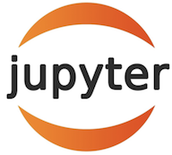
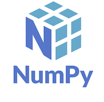

# Project-Debt-Free

## Technologies

This project utilizes a lot of different add ons, please make sure you have all these and they are up to date:

* [JupyterLab 3.4.4](https://jupyter.org/) - For the notebook creation and running of the code.

* [pandas 1.4.3](https://github.com/pandas-dev/pandas/blob/main/README.md) - For reading the csv files and other operations.

* [numpy](https://https://numpy.org/) - Loaded in, not used in the framework, but could be used in future editions.

* [hvplot v0.8.0](https://github.com/holoviz/hvplot#readme) - For creating interactive and more detailed plots.

* [fire](https://github.com/google/python-fire) - For the command line interface, help page, and entrypoint.

* [questionary](https://github.com/tmbo/questionary) - For interactive user prompts and dialogs

 
   
 

# Contributors

- Theena Dang
- Agnes Maria
- Nayana Narayanan
- Matthew Stream
- Hugo Velazquez 
